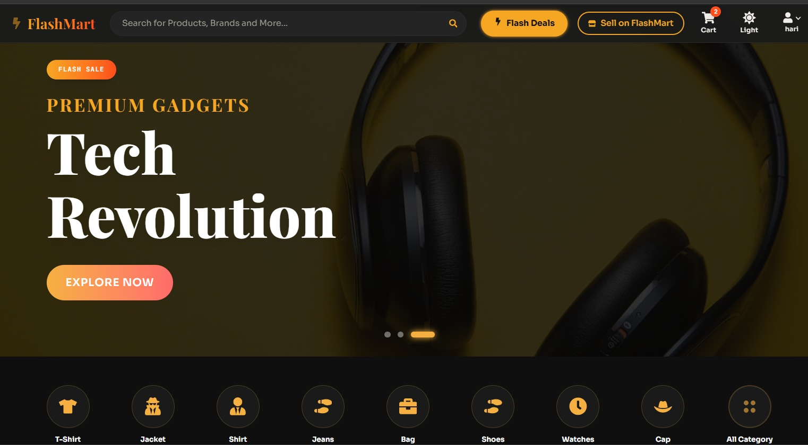
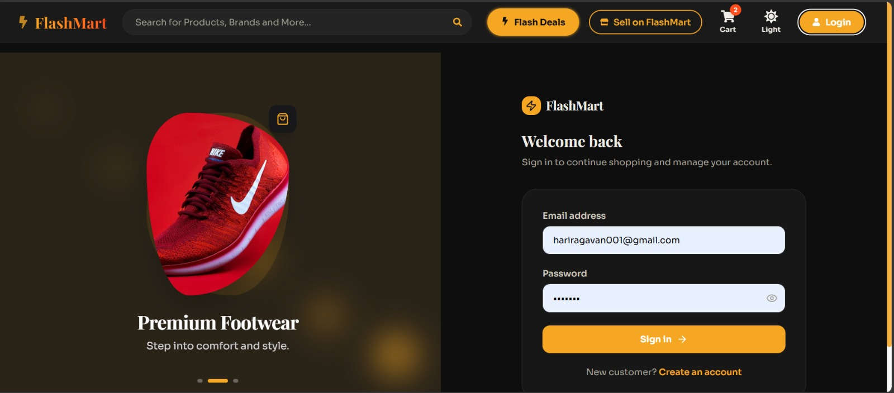
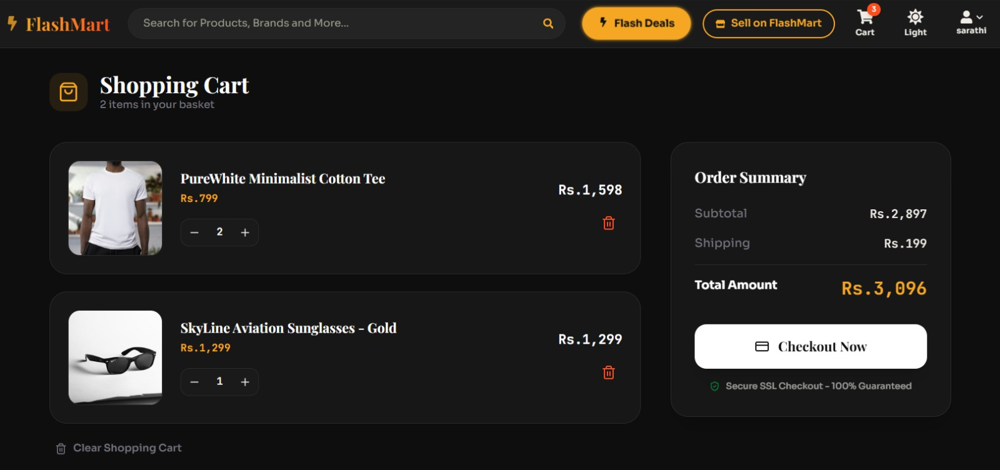
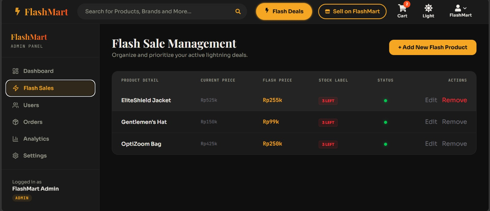

# 🚀 FlashMart – Intelligent Inventory Management & Flash Sale System

FlashMart is a full-stack MERN application focused on solving real-world e-commerce challenges like **inventory management**, **flash sales**, and **role-based access control**.

---

## 💡 Features

* 🔐 JWT-based Authentication (User / Seller / Admin)
* 🛍️ Product Listing & Details
* 🛒 Cart & Wishlist System
* 📊 Admin Dashboard with CRUD Operations
* ⚡ Flash Sale Engine (Countdown + Limited Stock)
* 📦 Inventory Tracking & Management

---

## 🧠 System Highlights

* Role-Based Access Control (RBAC)
* Scalable backend architecture (MVC pattern)
* Secure API design with middleware
* Modular code structure for maintainability

---

## ⚙️ Tech Stack

* **Frontend:** React, Tailwind CSS
* **Backend:** Node.js, Express
* **Database:** MongoDB
* **Authentication:** JWT

---

## 📸 Screenshots

### 🏠 Home Page



### 🔐 Login Page



### 📝 Flash sale Section


### ⚡ Cart and Checkout page 



### 📊 Admin Dashboard



---

## 🚀 Getting Started

## 🧑‍💻 How to Use / Run This Project

Follow these steps to run the project locally:

---

### 🔁 1. Fork the Repository

Click the **Fork** button (top-right of this repo) to create your own copy.

---

### 📥 2. Clone Your Fork

```bash
git clone https://github.com/hariragavan005/FlashMart-Inventory-Optimization-Flash-Sale-Engine-with-Role-Based-Access-Control-
cd flashmart
```

---

### 📦 3. Install Dependencies

#### Backend

```bash
cd backend
npm install
```

#### Frontend

```bash
cd ../frontend
npm install
```

---

### ⚙️ 4. Setup Environment Variables

Create a `.env` file inside the `backend` folder:

```env
MONGO_URI=mongodb://localhost:27017/ecommerceDB
JWT_SECRET=your_secret_key
PORT=5000
```

---

### ▶️ 5. Run the Application

#### Start Backend

```bash
cd backend
npm run dev
```

#### Start Frontend

```bash
cd frontend
npm start
```

---

### 🌐 6. Open in Browser

```text
http://localhost:5000
```

---

## 🛠️ Requirements

Make sure you have installed:

* Node.js (v16+)
* MongoDB (local or Atlas)
* npm or yarn

---

 


## 🚀 Future Improvements (Phase 2)

* Redis-based flash sale optimization
* Cloud image storage (Cloudinary)
* Smart inventory prediction
* ML-based recommendations

---

## 🤝 Contributing

Feel free to fork and contribute to this project.

---

## 📬 Connect

If you liked this project or want to collaborate, feel free to connect with me on LinkedIn.

---
